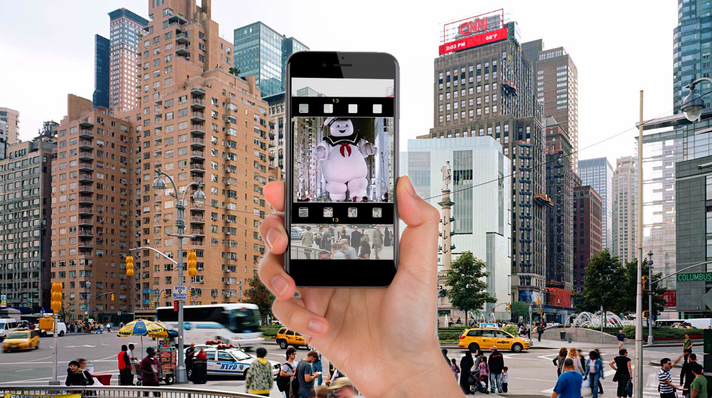

# Movie Marker

Movie Marker is an interactive augmented reality (AR) tour using your mobile device. Using the TomTom API, a tour will lead you through the city and reveal different locations where famous movies were filmed. Based on your location you will see a movie scene overlay with Viro AR. 

## Team

- [@sizplay](https://github.com/sizplay) - Chaehoon Lim
- [@aflemi2](http://www.github.com/aflemi2) - Alan Fleming
- [@marcopchen](http://www.github.com/marcopchen) - Marco Chen

## Demo
https://streamable.com/7atom

## Award
Winner of the "Tour with Augmented Reality" challenge from TomTom at the DeveloperWeek NY 2018 Hackathon

## Technologies

The Movie Marker app is built using React Native and Viro-React. We utilize the TomTom API to search nearby locations and set the markers for the user to find.

### API

TomTom created the easy-to-use navigation device, one of the most influential inventions of all time. Since then, their software and navigation technologies have been powering over hundreds of millions of applications across the globe. From industry-leading location-based products and mapmaking technologies, to embedded automotive navigation solutions; innovative personal navigation devices and apps to advanced telematics fleet management and connected car services.
- [TomTom](https://developer.tomtom.com/)
